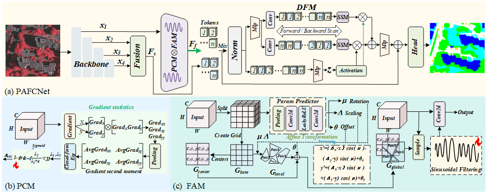

#  Physics-Aware Feature Calibration Network for Remote Sensing Image Segmentation

Junyi Wang, Guodong Fan<sup>&#42;</sup>, Jinjiang Li<br>
<sup>&#42;</sup> Corresponding author.

## 📚 Introduction
Official implementation of **PAFCNet**, a physics-aware feature calibration network designed for remote sensing image segmentation.

## 📖 Abstract
In remote sensing image segmentation, regions with sharp intensity variations caused by complex illumination and ground objects significantly constrain segmentation accuracy. Most existing methods attempt to enhance the model’s perception of these regions by introducing frequency features or relying on spatial convolutions. However, these methods tend to capture signal intensity, exhibiting limitations in distinguishing between sharp shadows and object edges in remote sensing images, which share similar intensities but stem from distinct physical origins. Through theoretical analysis, we observe that real edges typically exhibit an anisotropic gradient distribution, whereas shadow edges tend to show pseudo-isotropic local gradient statistics under texture perturbations. To this end, we propose PAFCNet (Physics-Aware Feature Calibration Network). The Physics Calibration Module (PCM) introduces a GLRT-inspired differentiable decision mechanism to transform the anisotropy analysis of local gradient second moment into a learnable statistical decision process, thereby adaptively enhancing the generalizability of theoretical analysis in real-world scenes. In parallel, the Frequency Analysis Module (FAM) constructs multidirectional object representations via affine transformations and parameterized kernel functions, while filtering out the interference of sharp shadows through the PCM. Finally, the Dual Domain Fusion Module (DFM) performs cross-sequence interaction between the physics-rectified frequency features and spatial features, thereby alleviating the semantic ambiguity associated with single-domain features. Experimental results demonstrate that PAFCNet outperforms state-of-the-art methods.

## 🏗️ Architecture
<p align="center">
  
</p>

## 📁 Project Structure
The repository is organized as follows:

```text
PAFCNet-main/ [Remote Sensing Segmentation Framework]
├── data/                       # dataset
│   ├── LoveDA/                 
│   ├── potsdam/                
│   └── vaihingen/              
│
├── fig_results/                # Experimental results and visualization
│   ├── loveda/                 
│   ├── potsdam/                
│   └── vaihingen/              
│
├── GeoSeg/                     # Main source code package
│   ├── config/                 # Configuration files
│   └── geoseg/                 
│       ├── datasets/           # Data loading and preprocessing modules
│       ├── losses/             # Loss function implementations
│       └── models/             # Model architectures and components
│   ├── tools/                  # Execution scripts
│   ├── loveda_test.py          
│   ├── potsdam_test.py         
│   ├── train_supervision.py    # Main training script
│   └── vaihingen_test.py       # Vaihingen evaluation script
│
├── lightning_logs/             # PyTorch Lightning training logs
│   ├── loveda/                 
│   ├── potsdam/                
│   └── vaihingen/              
│
├── model_weights/              # Trained model checkpoints
│   ├── loveda/                 
│   ├── potsdam/                
│   └── vaihingen/              
│
├── README.md                   
└── requirements.txt            # Python environment dependencies
```
---

## 📥 Datasets and Data Preparation

We conduct experiments on the **ISPRS Vaihingen** and **ISPRS Potsdam** datasets. The original datasets can be downloaded from their official websites:

- [ISPRS Vaihingen](https://www.isprs.org/resources/datasets/benchmarks/UrbanSemLab/2d-sem-label-vaihingen.aspx)
- [ISPRS Potsdam](https://www.isprs.org/resources/datasets/benchmarks/UrbanSemLab/2d-sem-label-potsdam.aspx)

We prepare and organize both datasets following [GeoSeg](https://github.com/WangLibo1995/GeoSeg). Dataset paths and experimental settings are specified in `GeoSeg/config/`, while data loading and transformations are implemented in `GeoSeg/geoseg/datasets/`.
